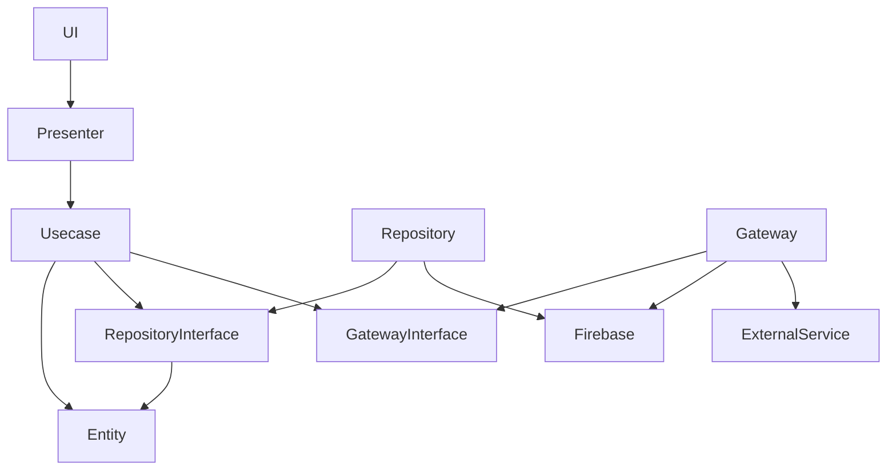
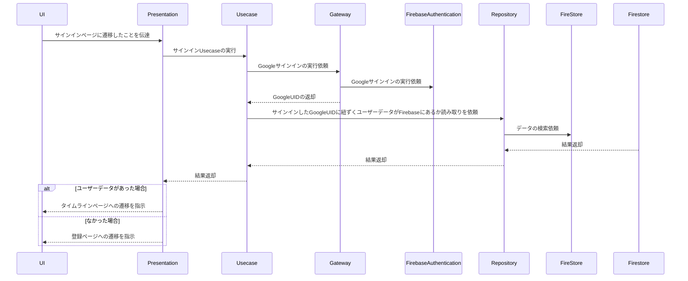
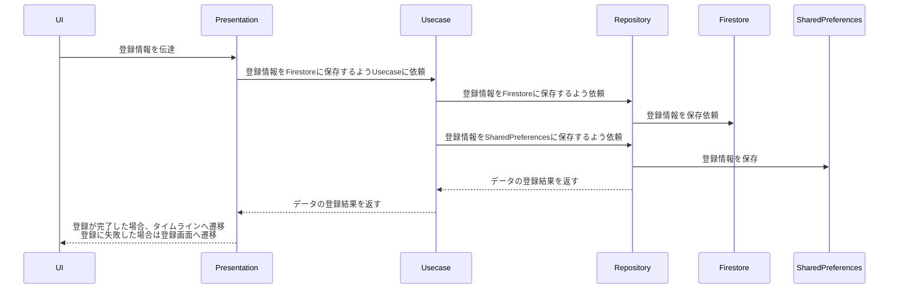
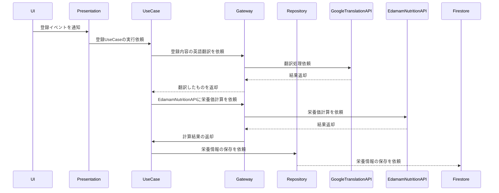

# 栄養情報共有アプリ
　摂取した食事から栄養価を計算、他者に共有するアプリを開発中です。

 ## ワイヤーフレーム

 |ログイン・登録ページ|ユーザーページ|タイムラインページ|投稿ページ|記事詳細ページ|
|--|--|--|--|--|
||||||

## アーキテクチャ図

### レイヤードアーキテクチャベースで実装

  ## シーケンス図(複雑なもののみ)
### サインインページ

### 登録ページ
  

### 栄養価登録ページ

- 
# 使用技術
- Flutter
- Firebase
  - Authentication
  - Firestore
- SharedPreference
  - ローカルにデータを保存するために使用
- Riverpod
  - Page全体のプレゼンテーションロジックのために使用
- Flutter Hooks
  - Componentに閉じたプレゼンテーションロジックの表現のみに使用
- 外部API
  - [GoogleTranslatorAPI](https://cloud.google.com/translate/?hl=ja)
     - EdamamNutritionAPIが英語しか対応していないので翻訳目的に使う
  - [EdamamNutritionAPI](https://developer.edamam.com/edamam-nutrition-api-demo)
    -　食事内容から栄養価を計算するAPI   
